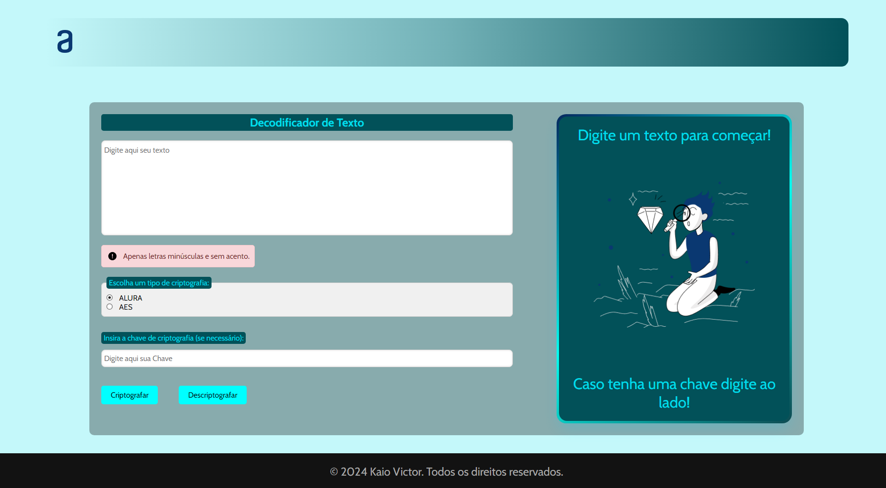
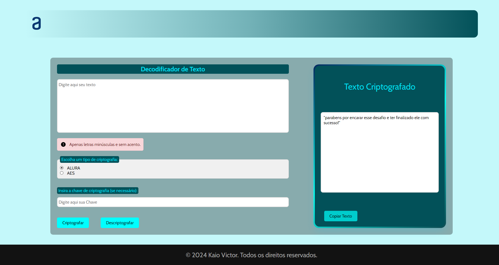

<h1 style="display: flex; justify-content: space-between; align-items: center; ">
  Decodificador de Texto
  
</h1>

Bem-vindo ao Decodificador de Texto! Este projeto foi desenvolvido como parte do **Challenge Decodificador de Texto**, que integra a **formação Iniciante em Programação da Alura** na trilha **ONE 7 - Oracle Next Education**.

---

## Funcionalidades

- **Criptografia e Descriptografia ALURA:** Substitui letras do texto por padrões específicos, como "e" por "enter" e "a" por "ai".
- **Criptografia e Descriptografia AES:** Utiliza o padrão avançado de criptografia AES-GCM, proporcionando alta segurança com geração de chaves dinâmicas.
- **Verificação de Texto:** O texto inserido deve conter apenas letras minúsculas e sem acentos ou números.
- **Cópia Rápida:** Permite copiar facilmente o texto e a chave criptografada/descriptografada para a área de transferência.

## Como Usar

1. **Insira o Texto:** Digite o texto que deseja criptografar ou descriptografar no campo de entrada.
2. **Selecione o Tipo de Criptografia:** Escolha entre ALURA ou AES.
3. **Insira a Chave de Criptografia:** Se necessário, insira a chave no campo correspondente (obrigatório para AES).
4. **Clique em Criptografar ou Descriptografar:** A ferramenta processará o texto de acordo com a opção selecionada.
5. **Copiar Resultado:** Utilize os botões de cópia para copiar o texto ou a chave resultante.

---

## AES

## Estrutura do Projeto

- **index.html:** Estrutura HTML principal.
- **styles/style.css:** Estilos CSS para layout e design.
- **scripts/script.js:** Funções JavaScript que controlam a criptografia, descriptografia e manipulação da interface.

## Requisitos

- Navegador moderno com suporte a JavaScript.

## Tecnologias Utilizadas

- **HTML5**
- **CSS3**
- **JavaScript (ES6+)**
- **Web Cryptography API**
- **ChatGPT:** Otimizando os resultados e auxiliando no desenvolvimento.

## Créditos

- **Desenvolvido por:** Kaio Victor
- **Design Inspirado por:** [Alura](https://www.alura.com.br)

## Licença

Este projeto é licenciado sob os termos da licença MIT.

